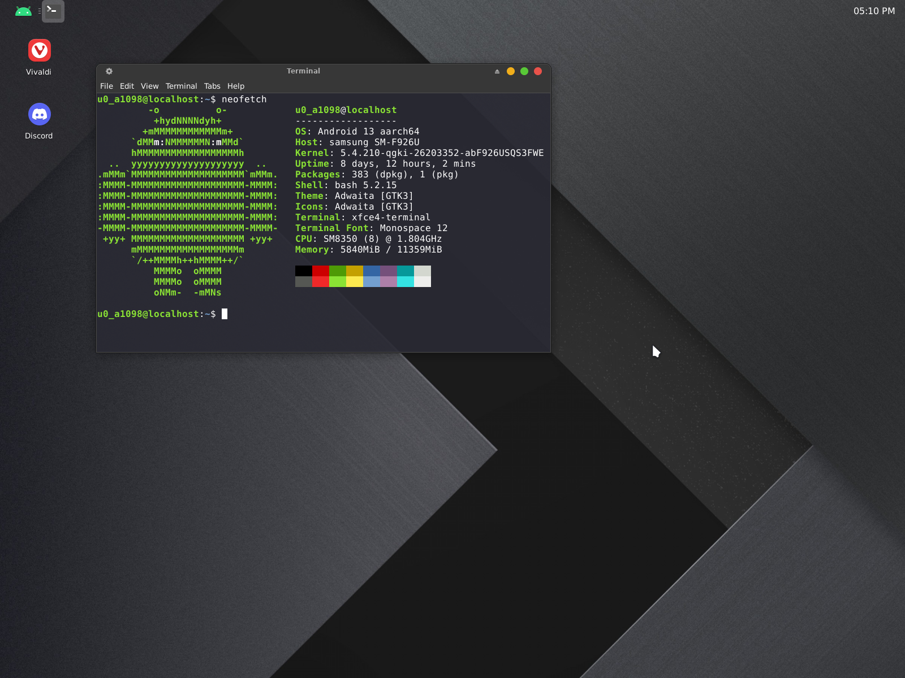

# Termux_XFCE

Sets up a termux XFCE desktop and a Debian proot install and installs some additional software like Firefox and Webcord, a discord client.

You only need to pick your username and follow the prompts to create a password for vncserver. This will take roughly 4GB of storage space. Please note, this can be a lengthy process.

This setup uses Termux-X11, the termux-x11 server will be installed and you will be prompted to allow termux to install the Android APK. It will also setup vncserver.

This is is how I personally use Termux on my Galaxy Fold 3, script was created mainly for personal use but also for others if they wanted to try out my setup. This is my daily driver used with a 15 inch Lepow portable monitor and bluetooth keyboard and mouse.

&nbsp;
# Starting the desktop

During install you will recieve a popup to allow installs from termux, this will open the APK for the Termux-X11 android app. While you do not have to allow installs from termux, you will still need to install manually by using a file browser and finding the APK in your downloads folder. 
  

After install you will need to exit termux using the command ```exit```
  
Once you restart termux you can use the command ```start``` 
  
This will start the termux-x11 server, XFCE4 desktop and open the Termux-X11 app right into the desktop. 

To start vnc use the command ```vncstart``` and to stop vnc use the command ```vncstop```

To enter the Debian proot install from terminal use the command ```debian```

Also note, you do not need to set display in Debian proot as it is already set. This means you can use the terminal to start any GUI application and it will startup.

&nbsp;

# Kill Termux X11

This will shut down your Termux-X11 session, you will have to manually close the Android apps

&nbsp;

# Kill vncserver

This will shut down your vncserver session, you will have to manually close the Android apps

&nbsp;

# Install

To install run this command in termux

```
pkg update && pkg upgrade && pkg install wget && wget https://raw.githubusercontent.com/phoenixbyrd/Termux_XFCE/main/setup.sh && chmod +x setup.sh && ./setup.sh
```

&nbsp;


