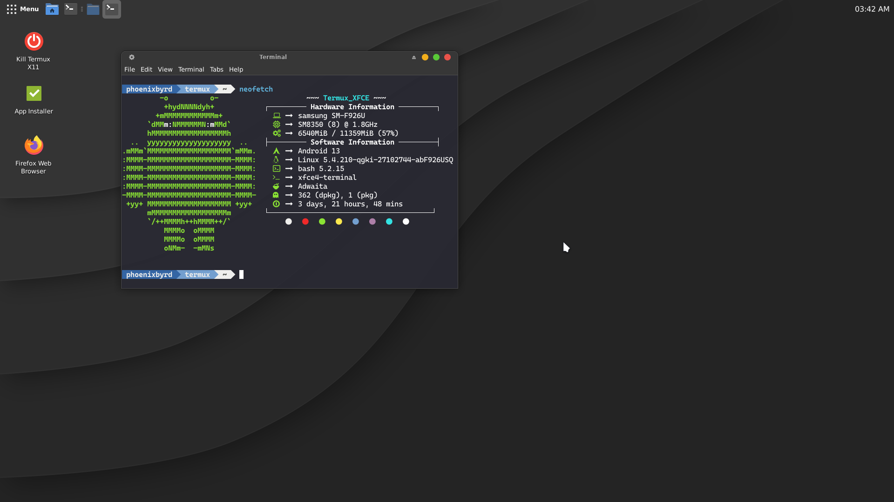

# Termux_XFCE

Sets up a termux XFCE desktop and a Debian proot install. This setup uses Termux-X11, the termux-x11 server will be installed and you will be prompted to allow termux to install the Android APK.

You only need to pick your username and follow the prompts. This will take roughly 4GB of storage space. Please note, this can be a lengthy process. Keep in mind that as you install applications, they will consume more storage space. 

Please read the whole Readme for more information about this setup.  

# Install

To install run this command in termux

```
curl -sL https://raw.githubusercontent.com/phoenixbyrd/Termux_XFCE/main/install.sh -o install.sh && chmod +x install.sh && ./install.sh
```
&nbsp;


Join the Discord for any questions, help, suggestions, etc. [https://discord.gg/pNMVrZu5dm](https://discord.gg/pNMVrZu5dm)  

&nbsp;


  
  
# Use Case
  
This is is how I personally use Termux on my Galaxy Fold 3, script was created mainly for personal use but also for others if they wanted to try out my setup. This is my daily driver used with a 15 inch Lepow portable monitor and bluetooth keyboard and mouse. This is mainly intended to be used as a PC/Laptop replacement connected to a monitor, keyboard and mouse and used as you would with any PC/Laptop. I run this on my Samsung Galaxy Fold 3.

  

&nbsp;

# Starting the desktop

During install you will recieve a popup to allow installs from termux, this will open the APK for the Termux-X11 android app. While you do not have to allow installs from termux, you will still need to install manually by using a file browser and finding the APK in your downloads folder. 
  
Use the command ```start``` to initiate a Termux-X11 session
  
This will start the termux-x11 server, XFCE4 desktop and open the Termux-X11 app right into the desktop. 

To enter the Debian proot install from terminal use the command ```debian```

Also note, you do not need to set display in Debian proot as it is already set. This means you can use the terminal to start any GUI application and it will startup.

&nbsp;

# Hardware Acceleration & Proot

Here are some aliases prepared to make launching things just a little easier.

Termux XFCE:

zrun - Launch apps in Debian proot with hardware acceleration

zrunhud - Same thing but with fps hud

hud - Display fps hud for games in Termux

Debian proot:

zink - Launch apps with hardware accleration

hud - Display fps hud
    
To enter proot use the command ```debian```, from there you can install aditional software with apt and use cp2menu in termux to copy the menu items over to termux xfce menu. 

Nala has been chosen as a front end in Debian proot. As it is currently setup, you do not need to issue sudo prior to running apt. This allows for you to just run apt update, apt upgrade, etc without also using sudo. This is setup similar in Termux as well and works just the same.

&nbsp;

There are two scripts available for this setup as well
  
```prun```  Running this followed by a command you want to run from the debian proot install will allow you to run stuff from the termux terminal without running ```debian``` to get into the proot itself.
  
```cp2menu``` Running this will pop up a window allowing you to copy .desktop files from debian proot into the termux xfce "start" menu so you won't need to launch them from terminal. A launcher is available in the System menu section.

&nbsp;

# Process completed (signal 9) - press Enter

install LADB from playstore or from here https://github.com/hyperio546/ladb-builds/releases

connect to wifi   
  
In split screen have one side LADB and the other side showing developer settings.
  
In developer settings, enable wireless debugging then click into there to get the port number then click pair device to get the pairing code.
  
Enter both those values into LADB
  
Once it connects run this command
  
```adb shell "/system/bin/device_config put activity_manager max_phantom_processes 2147483647"```

You can also run adb shell from termux directly by following the guide found in this video

[https://www.youtube.com/watch?v=BHc7uvX34bM](https://www.youtube.com/watch?v=BHc7uvX34bM)
